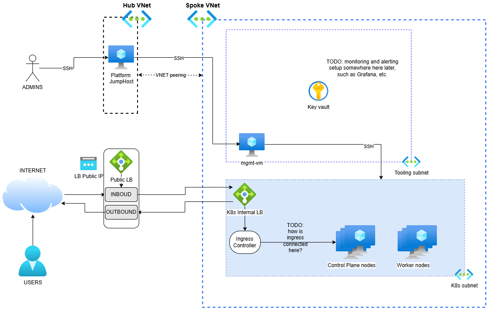

# High-Level Design/Architecture

This document describes the **Architecture/HLD (High-Level Design)** of the system. It defines the system at a macro level: major components, boundaries, integration patterns, non-functional requirements, and technology decisions, etc.

TODO: here add the architecture/HLD diagram and explain it, etc.

TODO: some things missing and not yet implemented in initial setup:
- Monitoring & Alerting, such as via Grafana and Prometheus, etc.
- Distributed Tracing, such as via Jaeger and OpenTelemetry, etc.
- Secrets Management, such as via HashiCorp Vault or KeyVault, etc.
- CI/CD, such as via GitHub Actions, etc.
- Automated backup and disaster recovery, such as via saving in free DB setup like MongoDB Atlas, etc.
- Etc...