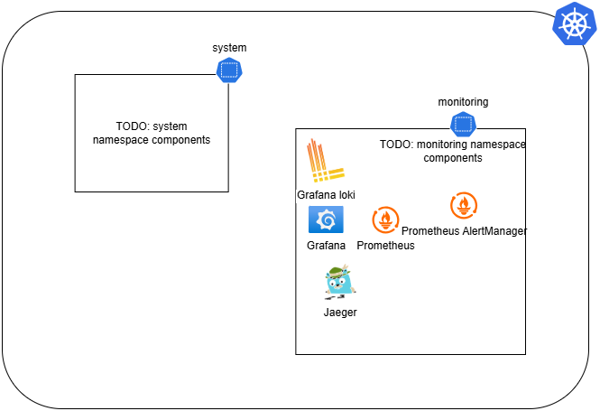

# Low-Level Design

This document describes the **Design/LLD (Low-Level Design)** of the system. It defines how architecture is implemented at a more concrete level, including component behavior, APIs, data models, and implementation choices, etc.

TODO: update with final design and architecture in this document when the full implementation is done, and also while implementing and anything changes!

TODO: here comes the design of the actual K8s cluster, the HLD describes the infra setup and high-level setup, this is the low-level setup which is the actual K8s cluster design and setup, such as CNI used, Node connections, etc.